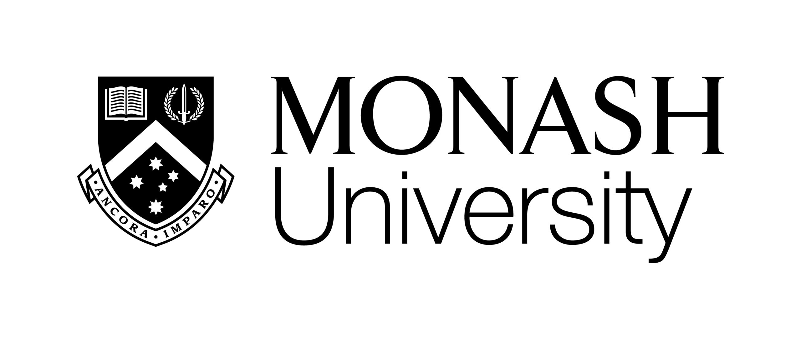
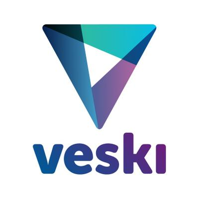
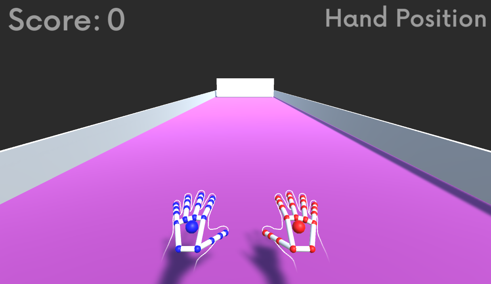
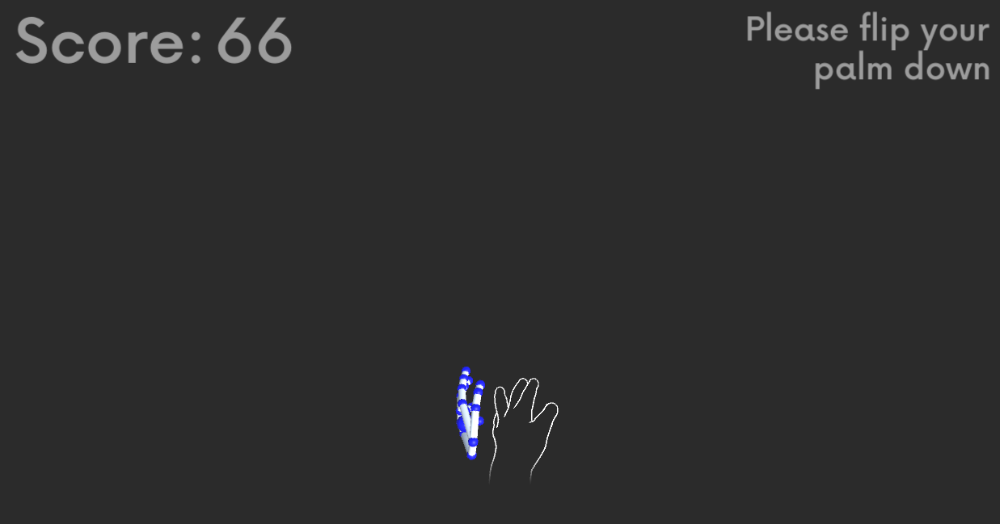

# Gamification of Stroke Rehabilitation Process 
## Collaboration
This research is the collaboration between Monash Universtiy (Australia) and Danang University of Technology (Vietnam)
  

## Funding
This research is made possible by VESKI Study Melbourne Research Partnership(SMRP)Program
  

## What is "Gamification of Stroke Rehabilitation Process"?
We are gamifying the stroke rehab process to use with a low-cost hand tracking device Ultra LEAP Hand Motion Capture Device.
  
The game aims to motivate post-stroke patients to participate in their rehab exercises and provide usefull feedback to both the patients and the occupational therapists
  

## Requirements

- Unity 2020.3.33f1
    - Make sure Universal Windows Platform is selected during installation
- Visual Studio 2019
    - Make sure the following are selected:
        - 'Universal Windows Platform development' under 'Workloads'
        - C++ Universal Windows Platform support for v142 build tools (ARM64)
        - MSVC v142 - VS 2019 C++ - ARM64 build tools (latest)
        - Windows 10 SDK (10.0.19041.0)

## Included

- Ultraleap Tracking
- Ultraleap Tracking Preview
- TextMeshPro
- Probuilder
- InputSystem

